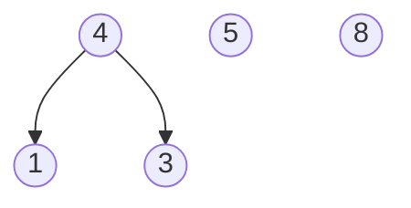
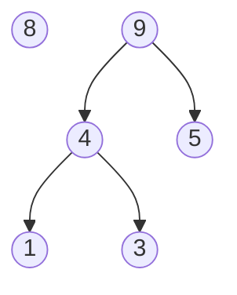
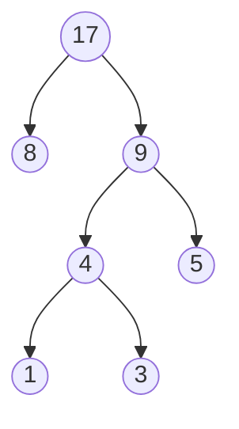

# 哈夫曼树

## 定义

带权路径长度（WPL）：设二叉树有n个叶子结点，每个叶子节点带有权值W<sub>k</sub>，从根结点到每个叶子节点的长度为L<sub>k</sub>,则每个叶子结点的带权路径长度之和就是：$WPL=\sum_{k=1}^{n}W_kL_k$

## 特点

1. 没有度为1的结点
2. n个叶子结点的哈夫曼树共有2n-1个结点
3. 哈夫曼树的任意非叶子结点的左右子树交换后仍是哈夫曼树
4. 同一组权值，存在不同构的哈夫曼树

## 图解

### 初始


### 第一次合并



### 第二次合并



### 第三次合并



## 模板

根据给定的n个权值，构造n棵只有根结点的二叉树。通过最小堆每次选取两棵根结点权值最小的树作为左右子树，构造一棵新的二叉树，并将其插入最小堆中。重复上述步骤，直到只有一棵树为止，这棵树就是哈夫曼树。

```c++
#include <iostream>
using namespace std;

#define MaxSize 1000
int A[] = {1, 3, 5, 8};
int A_length = 4;

struct TreeNode
{
    int weight;
    TreeNode *left;
    TreeNode *right;
};
struct MinHeap
{
    TreeNode **data; //这是一个数组，每个元素的类型为(TreeNode*),是指向某个哈夫曼树的指针
    int size;
    int capacity;
};

MinHeap *CreateHeap();                   // 初始化堆
TreeNode *CreateHT();                    // 初始化哈夫曼树
TreeNode *Delete(MinHeap *H);            // 删除最小堆元素
void Insert(MinHeap *H, TreeNode *Huff); // 插入最小堆元素
void PreOrderTraversal(TreeNode *Huff);  // 先序遍历
void BuildMinHeap(MinHeap *H);           // 建堆
TreeNode *Huffman(MinHeap *H);           // 哈夫曼树的构建

void LevelOrderTraversal(MinHeap *H)
{
    for (int i = 1; i <= A_length; i++)
    {
        printf("%d ", H->data[i]->weight);
    }
    cout << endl;
}

int main()
{
    MinHeap *H;
    TreeNode *Huff;
    H = CreateHeap();
    Huff = Huffman(H);
    PreOrderTraversal(Huff);
    system("pause");
    return 0;
}

// 初始化堆
MinHeap *CreateHeap()
{
    MinHeap *H;
    H = new MinHeap;
    H->data = new TreeNode *[MaxSize + 1]; // 每个元素的类型为(TreeNode*)
    H->capacity = MaxSize;
    H->size = 0;
    // 给堆设置哨兵，哨兵要小于堆内所有值
    TreeNode *Huff;
    Huff = CreateHT();
    Huff->weight = INT_MIN;
    H->data[0] = Huff;
    return H;
}

// 初始化哈夫曼树
TreeNode *CreateHT()
{
    TreeNode *Huff;
    Huff = new TreeNode;
    Huff->weight = 0;
    Huff->left = NULL;
    Huff->right = NULL;
    return Huff;
}

// 插入最小堆元素（哈夫曼树）
void Insert(MinHeap *H, TreeNode *Huff)
{
    int weight = Huff->weight;
    int i = ++H->size;
    for (; H->data[i / 2]->weight > weight; i /= 2)
    {
        H->data[i] = H->data[i / 2];
    }
    H->data[i] = Huff;
}

// 删除最小堆元素
TreeNode *Delete(MinHeap *H)
{
    int parent, child;
    TreeNode *T = H->data[1];
    TreeNode *tmp = H->data[H->size--];
    for (parent = 1; parent * 2 <= H->size; parent = child)
    {
        child = 2 * parent;
        if ((child != H->size) && (H->data[child + 1]->weight < H->data[child]->weight))
            child++;
        if (H->data[child]->weight >= tmp->weight)
            break;
        else
            H->data[parent] = H->data[child];
    }
    H->data[parent] = tmp;
    return T;
}

// 建堆
void BuildMinHeap(MinHeap *H)
{
    TreeNode *Huff;
    for (int i = 0; i < A_length; i++)
    {
        Huff = CreateHT();
        Huff->weight = A[i];
        Insert(H, Huff);
    }
}

void PreOrderTraversal(TreeNode *Huff)
{
    if (Huff)
    {
        cout << Huff->weight << " ";
        PreOrderTraversal(Huff->left);
        PreOrderTraversal(Huff->right);
    }
}

//构建哈夫曼树
TreeNode *Huffman(MinHeap *H)
{
    TreeNode *T;
    BuildMinHeap(H);
    int times = H->size;
    // 做times-1次合并
    for (int i = 1; i < times; i++)
    {
        T = new TreeNode;
        T->left = Delete(H);
        T->right = Delete(H);
        T->weight = T->left->weight + T->right->weight;
        Insert(H, T);
    }
    T = Delete(H);
    return T;
}
```

