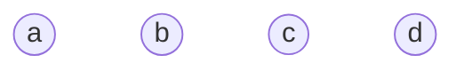
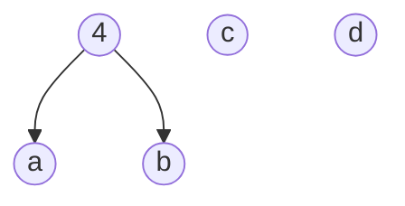
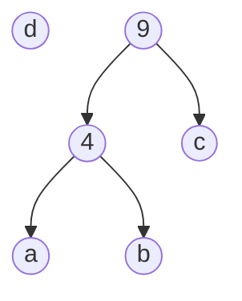
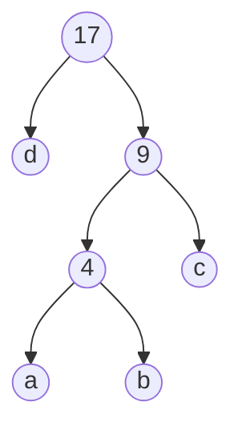

# 哈夫曼编码

使用变长编码表对字符进行编码，出现频率高的字符采用较短的编码，出现频率低的采用较长的编码。以达到编码后的字符串的平均长度尽可能短，以达到无损压缩数据的目的。

## 图解

有一字符串`string word = "abbbcccccdddddddd"`，字符`a`，`b`，`c`，`d`权重分别为1，3，5，8。

### 初始



### 第一次合并



### 第二次合并



### 第三次合并



```
字符  权重   编码
d     8     0
a     1     100
b     3     101
c     5     11
```

## 模板

按照字符串各字符的出现频率建立哈夫曼树，则每一个叶子结点对应一个字符。记每个结点的左分支为0，右分支为1，得到的编码即为哈夫曼编码。

```c++
/* 
结构中左右结点未设置为空，导致在先序遍历时进入空结点输出权值报错！
*/

#include <iostream>
#include <map>
#include <queue>
using namespace std;

struct TreeNode
{
    int weight;
    char ch = ' ';
    string code;
    // 要设为空，不然在遍历时会出错
    TreeNode *left = NULL;
    TreeNode *right = NULL;
};

//自定义排序规则
class mycomparison
{
public:
    bool operator()(const TreeNode *a, const TreeNode *b)
    {
        return a->weight > b->weight;
    }
};

// 构建哈夫曼树
TreeNode *Huffman(priority_queue<TreeNode *, vector<TreeNode *>, mycomparison> *H)
{
    TreeNode *T;
    int times = H->size();
    // 做times-1次合并
    for (int i = 1; i < times; i++)
    {
        T = new TreeNode;
        T->left = H->top();
        H->pop();
        T->right = H->top();
        H->pop();
        T->weight = T->left->weight + T->right->weight;
        H->push(T);
    }
    // T = H->top();
    // H->pop();
    return H->top();
}

// 改写先序遍历，输出叶子结点
void PreOrderTraversal(TreeNode *Huff)
{
    if (Huff)
    {
        if (Huff->ch != ' ')
        {
            cout << Huff->ch << "     " << Huff->weight << "        " << Huff->code << endl;
        }
        PreOrderTraversal(Huff->left);
        PreOrderTraversal(Huff->right);
    }
}

// 哈夫曼树编码
void GetCode(TreeNode *Huff, string code)
{
    if (Huff)
    {
        Huff->code = code;
        GetCode(Huff->left, code + "0");
        GetCode(Huff->right, code + "1");
    }
}

int main()
{
    string word = "abbbcccccdddddddd";
    map<char, int> Hash;
    for (auto ch : word)
    {
        if (!Hash.count(ch))
        {
            Hash.emplace(ch, 1);
        }
        else
        {
            Hash[ch]++;
        }
    }
    // 删除空格
    /Hash.erase(' ');
    // 建堆
    priority_queue<TreeNode *, vector<TreeNode *>, mycomparison> MinHeap;
    int count = 0;
    for (auto i : Hash)
    {
        TreeNode *T = new TreeNode;
        T->weight = i.second;
        T->ch = i.first;
        MinHeap.push(T);
    }
    TreeNode *Tree = Huffman(&MinHeap);
    GetCode(Tree, "");
    cout << "Char  Weight   Code" << endl;
    PreOrderTraversal(Tree);
    system("pause");
    return 0;
}
```

