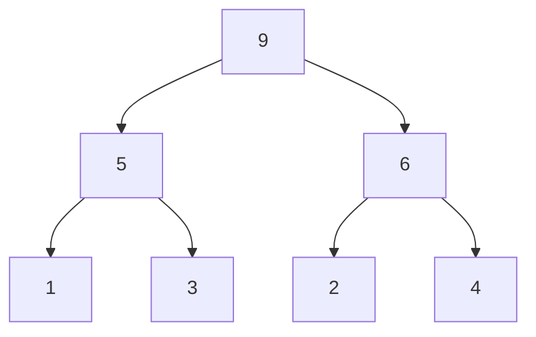
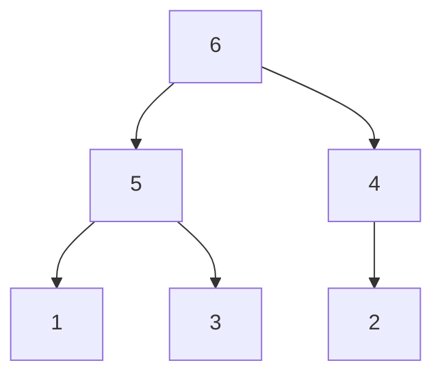
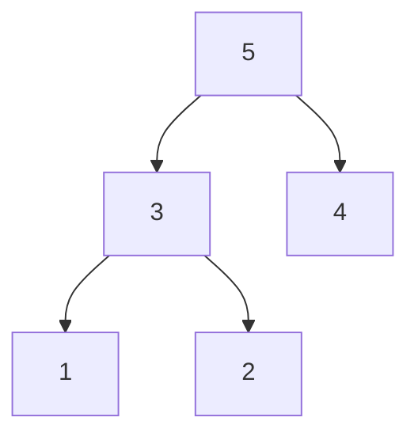

# 堆

## 定义
优先队列：取出元素的顺序是依照元素的优先级(关键字)大小，而不是元素进入队列的先后顺序，以完全二叉树的形式存储。

# 最大堆
完全二叉树，每个结点的元素值不小于其子结点的元素值

## 插入
插入数组最后一个位置，再从下到上找合适的地方

## 删除
先删除根结点，再将数组中末尾元素放到根结点从上往下找合适的地方

##### 初始


##### 删除一次


##### 删除二次


## STL

```c++
#include <queue>
    // max_heap
    priority_queue<int, vector<int>, less<int>> a;
    // min_heap
    priority_queue<int, vector<int>, greater<int>> b;
    for (int i = 0; i < 5; i++)
    {
        a.push(i);
        b.push(i);
    }
    while (!a.empty())
    {
        cout << a.top() << ' ';
        a.pop();
    }
    cout << endl;

    while (!b.empty())
    {
        cout << b.top() << ' ';
        b.pop();
    }
    cout << endl;
```

